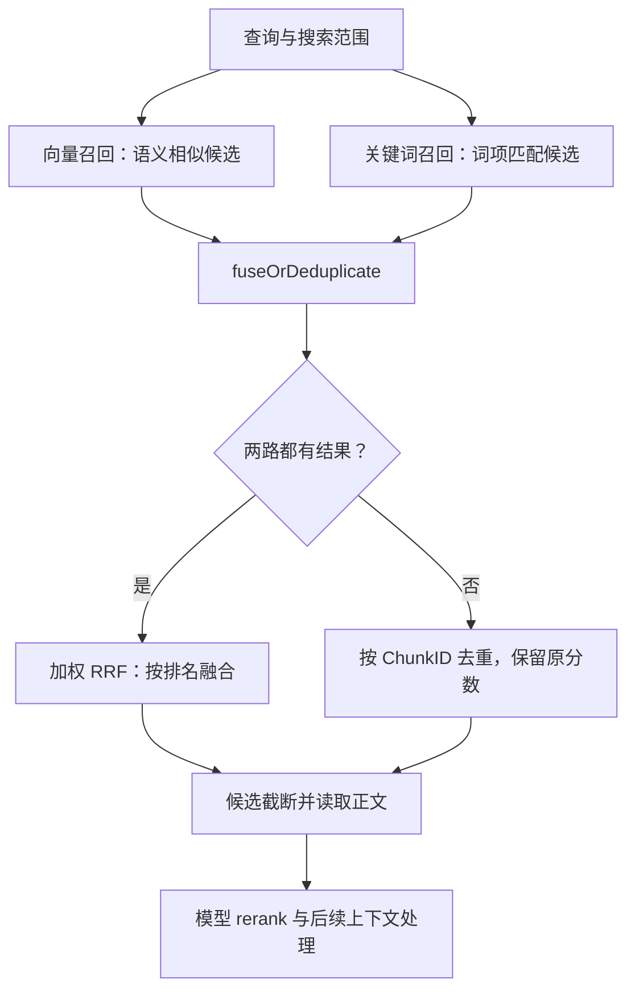

# 01 · 从召回到上下文：读懂 WeKnora 的 RRF 融合

| 项 | 值 |
|----|----|
| 主题 | 检索与 RAG · 源码走读 |
| 创建日期 / 最后更新 | 2026-09-21 |
| WeKnora 版本 | 官方标签 `v0.8.0` |
| 代码快照 | `1edcd54b43606d9079bb36650efe3f68707a79ea` |
| 状态 | 已核对源码与手算；学习自检待完成；未运行 WeKnora 端到端服务 |
| 阅读范围 | 普通文档知识库的 KnowledgeQA 主链路，重点是双路召回后的 RRF |

> 版本说明：本仓库首页原先记录的本地快照是 `f2606629b3204b6e7f07f024e1ee247bbf810f80`（2026-09-16），官方 `v0.8.0` 标签指向上面的 `1edcd54b`（2026-09-03）。本篇所有源码链接固定到官方标签对应提交。两份快照的 `knowledgebase_search_fusion.go` 已逐字比对一致；不据此推断其他文件也一致。

## 一句话结论

**RRF（Reciprocal Rank Fusion，倒数排名融合）把不同检索渠道给出的候选排名转换成可相加的融合分数，按 chunk 去重并重新排序；它位于 `HybridSearch` 内部，早于模型 rerank，更早于拼装上下文的 `CHUNK_MERGE`。**

## 背景与问题

阅读目标不是背出五个阶段，而是能沿着一个 chunk 回答：

1. 它从哪个检索渠道进入候选列表？
2. 它的 `Score` 现在表示什么？
3. 哪一行代码改变排名、哪一处过滤它、哪一处截断数量？
4. 最后交给生成模型的是 ID、分数，还是文档正文？

首轮只跟踪单个普通文档知识库、单 store、向量和关键词两路都有结果的情况。FAQ、实体检索、多个 embedding 模型和多个 store 会引入额外分支，本文只标出边界，不把它们的行为套入这个简化例子。

## 1. 先找到“谁调用谁”

打开 [session_knowledge_qa.go:193–206](https://github.com/Tencent/WeKnora/blob/1edcd54b43606d9079bb36650efe3f68707a79ea/internal/application/service/session_knowledge_qa.go#L193-L206)，能看到普通 RAG 分支的事件顺序：

`QUERY_UNDERSTAND → CHUNK_SEARCH_PARALLEL → CHUNK_RERANK → CHUNK_MERGE → FILTER_TOP_K → INTO_CHAT_MESSAGE → CHAT_COMPLETION_STREAM`

这里省略了可选的 `WEB_FETCH` 和 `DATA_ANALYSIS`，没有改变这些核心事件的相对顺序。

**没有名为 RRF 的流水线事件。** 要继续进入搜索事件的实现：

| 阅读顺序 | 真实调用位置 | 此时发生什么 |
|---|---|---|
| 1 | `PluginSearchParallel.OnEvent`，search_parallel.go:116–157 | 调用普通 chunk 搜索；实体搜索是另一路；最后追加并去重 |
| 2 | `PluginSearch.searchByTargets`，search.go:348 起 | 按 embedding 模型组织目标，准备查询向量和搜索参数 |
| 3 | search.go:463–479；指定文档/标签分支在 search.go:522–561 | 设置 `MatchCount = EmbeddingTopK`、召回阈值以及 `SkipContextEnrichment: true`，调用 `HybridSearch` |
| 4 | `knowledgeBaseService.HybridSearch`，knowledgebase_search.go:223 | `retrieveFromStores` 取得各路召回结果 |
| 5 | knowledgebase_search.go:235、247 | `classifyRetrievalResults` 分组，随后 `fuseOrDeduplicate` |
| 6 | knowledgebase_search_fusion.go:33–49、84–141 | 双路非空才进入 `fuseWithRRF` |
| 7 | knowledgebase_search.go:265–270 | 按 `MatchCount` 截断，再 `processSearchResults` 取得正文等信息 |
| 8 | `PluginRerank.OnEvent` | 候选文本送模型，模型分数过滤，再计算综合分并选取候选 |
| 9 | `PluginMerge.OnEvent`、`PluginFilterTopK.OnEvent` | 补全/合并上下文，再排序并限制数量 |
| 10 | `PluginIntoChatMessage.OnEvent` | 片段文本填入上下文模板，生成 `UserContent` |

依据：[搜索编排][search]、[并行搜索][parallel]、[HybridSearch][hybrid]、[RRF 实现][fusion]。

以下图只画“候选如何分流、在哪里重新汇合”，函数细节以上表为准：



**两个“合并”要分清：**

- RRF 合并的是候选榜单，输出“哪些 chunk 应该排在前面”。
- `CHUNK_MERGE` 合并/补全的是 chunk 正文和上下文，输出“交给模型阅读哪些材料”。
- `CHUNK_SEARCH_PARALLEL` 对 chunk 搜索与实体搜索的追加去重，也不等于这里的向量/关键词 RRF。

## 2. 为什么召回后还需要 RRF？

设同一问题得到两张榜：

| 向量渠道 | 向量分数（教学假设） | 关键词渠道 | 关键词分数（教学假设） |
|---|---:|---|---:|
| A | 0.91 | C | 12.0 |
| B | 0.86 | B | 8.0 |
| C | 0.82 | D | 3.0 |

这些数字是为了演示“量尺不同”而假设的，不是 WeKnora 某个后端的实测输出，也不表示所有关键词检索器都返回这个范围。

直接比较 `12.0 > 0.91` 没有足够依据：不同渠道的打分机制不同。先做分数归一化是另一类方法；RRF 采用的办法是：**用每一路的名次产生贡献，再将同一 chunk 的贡献相加。**

RRF 的公式不直接使用原始分数的大小差距。因此，对于已经固定的两张排名表，把一张表的原始分数全部乘以 100，只要候选、顺序与身份不变，RRF 排名就不变。

这句话只适用于融合这一步。真实系统里的原始分数仍可能影响前置阈值、单路排序和保留哪一个重复对象。

RRF 不能召回两路都漏掉的 chunk，不能判断事实真假，也不能替代后续模型对“问题—正文”相关性的判断。

## 3. 先看函数签名，确定输入和输出

打开 [knowledgebase_search_fusion.go:84](https://github.com/Tencent/WeKnora/blob/1edcd54b43606d9079bb36650efe3f68707a79ea/internal/application/service/knowledgebase_search_fusion.go#L84)：

```go
func fuseWithRRF(
    ctx context.Context,
    vectorResults, keywordResults []*types.IndexWithScore,
    retrievalCfg *types.RetrievalConfig,
) []*types.IndexWithScore
```

这里的 `vectorResults` **不是向量数组**，而是“向量检索命中的候选对象列表”。

[types/retriever.go:76–112](https://github.com/Tencent/WeKnora/blob/1edcd54b43606d9079bb36650efe3f68707a79ea/internal/types/retriever.go#L76-L112) 定义了这些数据：

| 数据 | 可以怎样理解 |
|---|---|
| `[]*types.IndexWithScore` | 一个 slice，元素是指向候选对象的指针 |
| `ChunkID` | 同一片段在两路结果里的共同身份，RRF 用它对齐、去重 |
| `KnowledgeID / KnowledgeBaseID` | 所属文档 / 知识库 |
| `Content / MatchType / Score` | 候选内容、匹配信息和此阶段分数 |
| `*types.RetrievalConfig` | 本次融合使用的 k 和渠道权重；此调用处来自租户配置 |
| 返回值 | 按 RRF 分数降序排列的唯一 chunk 并集，类型仍是候选对象指针 slice |

**输入和输出的类型相同，`Score` 的含义却变了。**

另外，函数没有 query 参数，没有 embedding 参数，没有模型调用。它只能处理已经给出的候选和名次。

## 4. 用 A/B/C/D 手算一次，再回到代码

[retrieval_config.go:87–108](https://github.com/Tencent/WeKnora/blob/1edcd54b43606d9079bb36650efe3f68707a79ea/internal/types/retrieval_config.go#L87-L108) 的默认值：

- `rrfK = 60`
- `vectorWeight = 0.7`
- `keywordWeight = 0.3`

公式是：

```text
RRF(chunk) = 0.7 / (60 + 向量名次)
           + 0.3 / (60 + 关键词名次)
```

某一路没有命中时，那一路贡献是 **0**，不是“默认第 0 名”。名次从 1 开始。

仍用 `vector = [A, B, C]`、`keyword = [C, B, D]`：

| Chunk | 向量名次 | 关键词名次 | 算式 | RRF 分数 |
|---|---:|---:|---|---:|
| A | 1 | — | 0.7 / 61 | 0.011475410 |
| B | 2 | 2 | 0.7 / 62 + 0.3 / 62 | 0.016129032 |
| C | 3 | 1 | 0.7 / 63 + 0.3 / 61 | 0.016029144 |
| D | — | 3 | 0.3 / 63 | 0.004761905 |

输出顺序是 **B、C、A、D**。

B 在两路都不是第一，但两路都比较认可它，因此总贡献超过了只在向量榜出现的 A。C 和 B 都命中两路，不能只看“出现两次”；还要考虑各路名次和权重。本例向量权重更高，B 最终略高于 C。

`k=60` 是平滑常数，控制前后名次贡献的差距；**不是保留 60 条结果的 TopK**。k 越大，前几个名次的贡献越接近，但不能据此断言所有场景检索效果都会更好。

参数为 nil 时，方法内部会检查 nil receiver 并返回默认值；不是只要用 nil 指针调用 Go 方法就一定 panic。具体能否安全调用，取决于方法实现。

## 5. 三段 Go 代码读懂 RRF

### 5.1 把名次记进 map

源码 [fusion:88–101](https://github.com/Tencent/WeKnora/blob/1edcd54b43606d9079bb36650efe3f68707a79ea/internal/application/service/knowledgebase_search_fusion.go#L88-L101) 中，向量一路的核心代码：

```go
vectorRanks := make(map[string]int, len(vectorResults))
for i, r := range vectorResults {
    if _, exists := vectorRanks[r.ChunkID]; !exists {
        vectorRanks[r.ChunkID] = i + 1
    }
}
```

逐行读：

1. 建立 `ChunkID → 名次` 的 map，长度参数是容量提示。
2. `range` 给出从 0 开始的下标 `i` 和候选指针 `r`。
3. `value, exists := map[key]` 可以判断键是否存在；这里不需要 value，用 `_` 丢弃。
4. 只有第一次见到此 ChunkID 才记录 `i+1`，把数组下标转换为从 1 开始的名次。

**它没有根据 Score 给输入排序，而是直接相信传入的 slice 顺序。** 对单路检索而言，传入顺序就是它理解的排名。

重复 ID 也有一个细节：`[A, A, B]` 会记录 A=1、B=3，不会先去重成 A=1、B=2。

### 5.2 对齐同一 chunk，形成并集

源码 [fusion:103–113](https://github.com/Tencent/WeKnora/blob/1edcd54b43606d9079bb36650efe3f68707a79ea/internal/application/service/knowledgebase_search_fusion.go#L103-L113) 用 `map[string]*types.IndexWithScore` 保留候选对象：

- 先处理向量候选；同一个 ChunkID 重复出现，保留原始 Score 更高的对象。
- 再处理关键词候选；只补入 map 中还没有的 ChunkID。
- 因此，两路都命中 B 时输出只有一个 B，并优先沿用向量结果对象的元数据。

**记录“排名”和保留“对象”是两个动作。** 前者取首次出现的位置，后者在向量重复项中比较原始分数，不能混为一谈。

### 5.3 累加两路贡献，并改写 Score

源码 [fusion:117–128](https://github.com/Tencent/WeKnora/blob/1edcd54b43606d9079bb36650efe3f68707a79ea/internal/application/service/knowledgebase_search_fusion.go#L117-L128)：

```go
for chunkID, info := range chunkInfoMap {
    rrfScore := 0.0
    if rank, ok := vectorRanks[chunkID]; ok {
        rrfScore += vectorWeight / float64(rrfK+rank)
    }
    if rank, ok := keywordRanks[chunkID]; ok {
        rrfScore += keywordWeight / float64(rrfK+rank)
    }
    info.Score = rrfScore
    result = append(result, info)
}
slices.SortFunc(result, sortByScoreDesc)
```

这里应当看懂四件事：

- `ok` 为 false 就不加分，正好对应“未命中渠道贡献为 0”。
- `float64(...)` 把整数分母转换为浮点数。
- `info` 是指针，`info.Score = ...` 会改动所选输入对象。返回值不是一组深拷贝的新对象。
- map 遍历没有固定顺序，所以最后必须排序；比较器在分数相等时返回 0，此函数没有规定平分时谁在前。

这整个函数没有截断数量。裁剪发生在调用它的 `HybridSearch` 中。

## 6. 不是每次 HybridSearch 都会执行 RRF

[代码入口 fusion:33–49](https://github.com/Tencent/WeKnora/blob/1edcd54b43606d9079bb36650efe3f68707a79ea/internal/application/service/knowledgebase_search_fusion.go#L33-L49) 可以翻译为：

| 候选情况 | 实际执行 | 输出 Score |
|---|---|---|
| 向量、关键词都非空 | `fuseWithRRF` | RRF 分数 |
| 只有向量非空 | `deduplicateByScore(vectorResults)` | 最高的原始向量分数 |
| 只有关键词非空 | `deduplicateByScore(keywordResults)` | 最高的原始关键词分数 |
| 两路都空 | `HybridSearch` 提前返回空结果 | 无 |

开了两路检索，不代表两路本次都召回了结果。**触发 RRF 的条件是两路结果都非空。**

也不要用 `rrf_keyword_weight = 0` 表达“关闭关键词检索”：该版本 getter 会将非正渠道权重回退为默认值。是否检索一路，要看对应禁用参数、知识库索引配置和引擎能力；见 [buildRetrievalParams][hybrid]。

函数输出并集后，`HybridSearch` 还会执行适用的 FAQ 后处理、按 `params.MatchCount` 截断，再调用 `processSearchResults`。聊天路径的 MatchCount 来自 EmbeddingTopK，它控制送往下一阶段的候选规模，不等于最终进入上下文的条数。

## 7. 从 RRF 继续读到 rerank：分数再次改变

融合结果仍是索引候选。`processSearchResults` 批量取得文档和 chunk 信息，构造 `[]*types.SearchResult`，保留候选分数。聊天搜索传入 `SkipContextEnrichment: true`，把大部分上下文扩展留到 rerank 后的 merge 阶段，避免提前膨胀候选正文。依据：[结果处理][results]、[搜索调用][search]。

在 [rerank.go:74–87、124–149](https://github.com/Tencent/WeKnora/blob/1edcd54b43606d9079bb36650efe3f68707a79ea/internal/application/service/chat_pipeline/rerank.go#L74-L87)：

1. 从 SearchResult 构造非空的 `passages []string` 和与其位置对应的候选 slice。
2. 使用 `RewriteQuery` 作为问题。
3. 在 `PluginRerank.rerank` 内调用 `rerankModel.Rerank(ctx, query, passages)`。[rerank.go:345–351](https://github.com/Tencent/WeKnora/blob/1edcd54b43606d9079bb36650efe3f68707a79ea/internal/application/service/chat_pipeline/rerank.go#L345-L351)
4. 模型返回 `Index` 与 `RelevanceScore`，Index 将模型结果映射回对应候选。

RRF 只问“这个 chunk 在各路排第几”；rerank 则把问题和正文交给模型重新评分。RRF 不需要模型请求，rerank 需要配置的 rerank 模型。

### 阈值判断到底发生在哪？

[rerank.go:379–388](https://github.com/Tencent/WeKnora/blob/1edcd54b43606d9079bb36650efe3f68707a79ea/internal/application/service/chat_pipeline/rerank.go#L379-L388)：

```go
if result.RelevanceScore >= chatManage.RerankThreshold {
    rankFilter = append(rankFilter, result)
}
```

比较的是 **模型返回的 RelevanceScore**，不是 RRF 写入的 Score。

通过这个阶段后，[rerank.go:194–224、439–455](https://github.com/Tencent/WeKnora/blob/1edcd54b43606d9079bb36650efe3f68707a79ea/internal/application/service/chat_pipeline/rerank.go#L194-L224) 还会记录 `base_score`、`model_score`，并将 SearchResult.Score 改成综合分：

```text
composite = clamp(0.6 × modelScore + 0.3 × baseScore + 0.1 × sourceWeight, 0, 1)
```

普通来源的 sourceWeight=1，web_search 来源为0.95；之后还有适用的 FAQ 加权以及 MMR 候选选择（相关性与候选间相似性共同影响选择）。

所以不能把“rerank 后的 Score”简单写成“模型原始分数”。这一版代码确实还有综合评分和候选选择逻辑。

| 阶段 | 分数语义 | 用途 |
|---|---|---|
| 向量 / 关键词召回 | 对应检索渠道的分数 | 各路召回阈值、排序 |
| 双路 RRF 后 | 加权倒数名次之和 | 融合排序、候选截断 |
| 模型返回 | `RelevanceScore` | 与 RerankThreshold 比较 |
| 后续 SearchResult.Score | 综合分，可能再受 FAQ 加权影响 | MMR、后续排序与 TopK |

**默认 RRF 理论上限为 `(0.7+0.3)/(60+1) ≈ 0.01639344`。** 把 0.2 直接当作它的过滤阈值，会把所有正常融合结果滤掉。它也不是 0–1 的相关性概率。

### 不要把阈值写成“低于它必然消失”

本版本有降级和回退分支：

- 阈值过滤后为空，但模型返回的首项分数达到回退下限时，保留首项。普通范围的回退下限为0.15；有特定 recall-threshold override 的文档/标签范围时为0。[rerank.go:390–420](https://github.com/Tencent/WeKnora/blob/1edcd54b43606d9079bb36650efe3f68707a79ea/internal/application/service/chat_pipeline/rerank.go#L390-L420)
- 若仍为空且原阈值大于0.3，外层以 `max(原阈值×0.7, 0.3)` 重试，然后恢复配置值。[rerank.go:148–178](https://github.com/Tencent/WeKnora/blob/1edcd54b43606d9079bb36650efe3f68707a79ea/internal/application/service/chat_pipeline/rerank.go#L148-L178)
- 模型 API 报错时保留非空正文的原检索候选继续向后走；取得模型实例失败则返回错误。[rerank.go:64–72、132–148](https://github.com/Tencent/WeKnora/blob/1edcd54b43606d9079bb36650efe3f68707a79ea/internal/application/service/chat_pipeline/rerank.go#L64-L72)
- 无候选、无需检索或插件收到空模型 ID 时有跳过逻辑；不能据此推断完整产品配置一定允许不配置 rerank 模型。
- 最终没有可用 rerank 结果时会返回 `ErrSearchNothing`。[rerank.go:235–253](https://github.com/Tencent/WeKnora/blob/1edcd54b43606d9079bb36650efe3f68707a79ea/internal/application/service/chat_pipeline/rerank.go#L235-L253)

正常 KnowledgeQA 事件循环收到 `ErrSearchNothing` 后，会调用 `handleFallbackResponse` 并结束本次流水线，不再进入 `CHUNK_MERGE`。[session_knowledge_qa.go:774–782](https://github.com/Tencent/WeKnora/blob/1edcd54b43606d9079bb36650efe3f68707a79ea/internal/application/service/session_knowledge_qa.go#L774-L782) 下一节提到的 Merge 使用 SearchResult 回退，适用于 rerank 被跳过，或模型 API 报错后通过 `next()` 继续等情况。

## 8. merge、TopK 和上下文拼装分别做什么？

`PluginMerge.OnEvent` 优先取 `RerankResult`，没有时取 `SearchResult`。它围绕被选中的结果处理父子片段、邻近片段、重叠内容、历史相关结果等，写入 `MergeResult`。这里的详细策略留给下一篇；当前先记住它操作的是上下文材料。依据：[merge.go][merge]。

`PluginFilterTopK.OnEvent` 对当前可用结果排序，再按 RerankTopK 截断，优先操作 MergeResult，其次 RerankResult、SearchResult。**FILTER_TOP_K 是数量限制，不是另一次 RerankThreshold 判断。** 同分排序会继续比较文档、片段类型、片段序号和 ID；这与 RRF 函数自身未规定同分顺序是不同层面的事情。[filter_top_k.go:41–59、76–95](https://github.com/Tencent/WeKnora/blob/1edcd54b43606d9079bb36650efe3f68707a79ea/internal/application/service/chat_pipeline/filter_top_k.go#L41-L59)

在 [into_chat_message.go:121–192](https://github.com/Tencent/WeKnora/blob/1edcd54b43606d9079bb36650efe3f68707a79ea/internal/application/service/chat_pipeline/into_chat_message.go#L121-L192)，普通文档结果大致变成：

```xml
<context id="1">第一个片段的正文</context>
<context id="2">第二个片段的正文</context>
```

还会附带适用的文档元信息。它们先形成 `RenderedContexts`，再和 query、language 等填入 `SummaryConfig.ContextTemplate`，形成 `UserContent`，交给后续聊天生成阶段。

因此，这条链路最终是在挑选、处理并组织**供生成模型阅读的文本证据**。RRF 排第一只表示它在该融合阶段排第一，不能直接等同于“最终上下文第一”或“最终答案一定引用它”。

## 9. 对原来五阶段口号的修正

“召回 → 融合 → rerank → 阈值过滤 → 上下文拼装”可以作为概念入口，但读源码时应补上：

| 原来的理解 | 此版本更准确的读法 |
|---|---|
| 阈值只在 rerank 后出现 | 召回参数也携带 vector/keyword 阈值；rerank 内还有模型分数阈值与回退 |
| 融合是一个单独流水线事件 | RRF 在 HybridSearch 内部，只在双路非空时发生 |
| merge 就是排名融合 | CHUNK_MERGE 负责上下文扩展和正文合并 |
| rerank 输出模型分数并结束 | 模型分数过滤后还有综合评分、MMR 等处理 |
| 只需要一个 TopK | 召回深度、融合后的 MatchCount、rerank/merge 后的数量限制属于不同阶段 |

读调参代码时，每遇到一个阈值或 TopK，先问：**它限制的是哪一批数据，比较的是哪个阶段的分数？**

## 10. 已验证、边界与待验证事项

✅ 已通过固定提交源码核对：

- RRF 调用位置、双路触发条件、输入输出类型、默认参数。
- 按首次出现位置取 rank；按 ChunkID 形成并集。
- Score 会被原地改写；RRF 内部没有 TopK 截断。
- 模型阈值比较 RelevanceScore；FILTER_TOP_K 不做模型阈值判断。
- 上文 A/B/C/D 的算术结果。

⚠️ 多 store 是必须保留的边界：

`fuseWithRRF` 不排序输入；`classifyRetrievalResults` 只是按类型 append。该提交的 `retrieveFromStores` 收集并发结果并在适用时归一化分数，所读路径没有在融合前对全部同类型候选做一次全局排序。因此，不能把“RRF 输入必然是全局排序好的向量榜/关键词榜”当成已验证事实。单 store 的教学例子不要无条件推广到多 store。依据：[knowledgebase_search_fanout.go:74–130](https://github.com/Tencent/WeKnora/blob/1edcd54b43606d9079bb36650efe3f68707a79ea/internal/application/service/knowledgebase_search_fanout.go#L74-L130)、[fusion:13–27](https://github.com/Tencent/WeKnora/blob/1edcd54b43606d9079bb36650efe3f68707a79ea/internal/application/service/knowledgebase_search_fusion.go#L13-L27)。

🤔 待实验验证：在多 store 场景构造相同候选、不同返回顺序，观察融合结果是否变化以及是否影响截断边界。当前只有源码观察，尚未运行环境复现，不在这里把它定性成已证实的线上故障。

### 实验记录

| 项目 | 方法 / 参数 | 结果 | 证据等级 |
|---|---|---|---|
| 手算与独立算术复核 | V=[A,B,C]，K=[C,B,D]，k=60，权重0.7/0.3 | B > C > A > D | 算术验证，非服务运行 |
| 快照对照 | 官方标签提交 vs 仓库原记录 f2606629 | fusion 文件内容一致 | 源文件比对 |
| 端到端检索质量 | 尚未部署服务、调用向量库/模型 | 无实验结论 | 待做 |

## 11. 理解自检：先尝试回答，再展开

这部分用于检查是否能从代码推出行为；不因笔记写好就视为已经掌握。

1. 保持两路候选和顺序不变，只改变向量原始分数，RRF 公式计算的结果会改变吗？
2. 关键词一路突然变成空列表，此时函数输出还会是约0.01的 RRF 分数吗？
3. B 为什么可以在两路都排第二，却在融合后排第一？
4. 为什么不能用 RerankThreshold=0.2 直接过滤 RRF Score？
5. `info.Score = rrfScore` 之后，外面持有的同一个对象会不会看到新分数？
6. 在哪里限制“进入下一阶段的候选数”，在哪里拼正文？它们与 RRF 的 k 是一回事吗？

<details>
<summary>参考答案</summary>

1. 不会改变基于相同排名的 RRF 分数；不过实际召回的阈值/排名可能受原始分数影响。
2. 不会执行 RRF；按 ChunkID 去重并保留最高原始向量分数。
3. 它累计了两路都靠前的贡献；A 只有一路贡献。是否第一仍要按具体名次和权重计算。
4. 两种分数含义和范围不同；模型阈值应比较 RelevanceScore。
5. 会。map 和返回 slice 持有的是所选输入对象的指针，没有深拷贝。
6. HybridSearch 按 MatchCount 截断候选；rerank/MMR 和 FILTER_TOP_K 还有后续限制；CHUNK_MERGE/INTO_CHAT_MESSAGE 负责上下文处理；k 是排名贡献的平滑常数。

</details>

下一轮建议只读 `PluginRerank.rerank` 的模型返回值到 `rankFilter`，用一组低于阈值的候选追踪 fallback，再解释为什么“阈值0.5”未必意味着最终所有候选模型分数都至少0.5。

## 源码索引

所有链接均固定到同一提交，不使用 main 的浮动行号。

| 关注点 | 源码 |
|---|---|
| 普通 RAG 事件编排 | [session_knowledge_qa.go:193](https://github.com/Tencent/WeKnora/blob/1edcd54b43606d9079bb36650efe3f68707a79ea/internal/application/service/session_knowledge_qa.go#L193) |
| 普通检索如何调用 HybridSearch | [chat_pipeline/search.go:348](https://github.com/Tencent/WeKnora/blob/1edcd54b43606d9079bb36650efe3f68707a79ea/internal/application/service/chat_pipeline/search.go#L348) |
| chunk / entity 并行搜索边界 | [chat_pipeline/search_parallel.go:89](https://github.com/Tencent/WeKnora/blob/1edcd54b43606d9079bb36650efe3f68707a79ea/internal/application/service/chat_pipeline/search_parallel.go#L89) |
| 双路召回、融合调用、截断 | [knowledgebase_search.go:223](https://github.com/Tencent/WeKnora/blob/1edcd54b43606d9079bb36650efe3f68707a79ea/internal/application/service/knowledgebase_search.go#L223) |
| RRF 完整实现 | [knowledgebase_search_fusion.go:13](https://github.com/Tencent/WeKnora/blob/1edcd54b43606d9079bb36650efe3f68707a79ea/internal/application/service/knowledgebase_search_fusion.go#L13) |
| k 与权重默认值 | [types/retrieval_config.go:86](https://github.com/Tencent/WeKnora/blob/1edcd54b43606d9079bb36650efe3f68707a79ea/internal/types/retrieval_config.go#L86) |
| 索引候选对象与检索返回值 | [types/retriever.go:75](https://github.com/Tencent/WeKnora/blob/1edcd54b43606d9079bb36650efe3f68707a79ea/internal/types/retriever.go#L75) |
| 索引候选转换为正文结果 | [knowledgebase_search_results.go:13](https://github.com/Tencent/WeKnora/blob/1edcd54b43606d9079bb36650efe3f68707a79ea/internal/application/service/knowledgebase_search_results.go#L13) |
| rerank、阈值、综合分、MMR | [chat_pipeline/rerank.go:39](https://github.com/Tencent/WeKnora/blob/1edcd54b43606d9079bb36650efe3f68707a79ea/internal/application/service/chat_pipeline/rerank.go#L39) |
| 正文上下文合并 | [chat_pipeline/merge.go][merge] |
| 最终排序与数量限制 | [chat_pipeline/filter_top_k.go:27](https://github.com/Tencent/WeKnora/blob/1edcd54b43606d9079bb36650efe3f68707a79ea/internal/application/service/chat_pipeline/filter_top_k.go#L27) |
| 模板与上下文正文 | [chat_pipeline/into_chat_message.go:121](https://github.com/Tencent/WeKnora/blob/1edcd54b43606d9079bb36650efe3f68707a79ea/internal/application/service/chat_pipeline/into_chat_message.go#L121) |
| 多 store 结果收集边界 | [knowledgebase_search_fanout.go:74](https://github.com/Tencent/WeKnora/blob/1edcd54b43606d9079bb36650efe3f68707a79ea/internal/application/service/knowledgebase_search_fanout.go#L74) |

返回：[检索与 RAG 索引](README.md)。

[pipeline]: https://github.com/Tencent/WeKnora/blob/1edcd54b43606d9079bb36650efe3f68707a79ea/internal/application/service/session_knowledge_qa.go#L193
[search]: https://github.com/Tencent/WeKnora/blob/1edcd54b43606d9079bb36650efe3f68707a79ea/internal/application/service/chat_pipeline/search.go#L348
[parallel]: https://github.com/Tencent/WeKnora/blob/1edcd54b43606d9079bb36650efe3f68707a79ea/internal/application/service/chat_pipeline/search_parallel.go#L89
[hybrid]: https://github.com/Tencent/WeKnora/blob/1edcd54b43606d9079bb36650efe3f68707a79ea/internal/application/service/knowledgebase_search.go#L223
[fusion]: https://github.com/Tencent/WeKnora/blob/1edcd54b43606d9079bb36650efe3f68707a79ea/internal/application/service/knowledgebase_search_fusion.go#L13
[config]: https://github.com/Tencent/WeKnora/blob/1edcd54b43606d9079bb36650efe3f68707a79ea/internal/types/retrieval_config.go#L86
[types]: https://github.com/Tencent/WeKnora/blob/1edcd54b43606d9079bb36650efe3f68707a79ea/internal/types/retriever.go#L75
[results]: https://github.com/Tencent/WeKnora/blob/1edcd54b43606d9079bb36650efe3f68707a79ea/internal/application/service/knowledgebase_search_results.go#L13
[rerank]: https://github.com/Tencent/WeKnora/blob/1edcd54b43606d9079bb36650efe3f68707a79ea/internal/application/service/chat_pipeline/rerank.go#L39
[merge]: https://github.com/Tencent/WeKnora/blob/1edcd54b43606d9079bb36650efe3f68707a79ea/internal/application/service/chat_pipeline/merge.go
[topk]: https://github.com/Tencent/WeKnora/blob/1edcd54b43606d9079bb36650efe3f68707a79ea/internal/application/service/chat_pipeline/filter_top_k.go#L27
[context]: https://github.com/Tencent/WeKnora/blob/1edcd54b43606d9079bb36650efe3f68707a79ea/internal/application/service/chat_pipeline/into_chat_message.go#L121
[fanout]: https://github.com/Tencent/WeKnora/blob/1edcd54b43606d9079bb36650efe3f68707a79ea/internal/application/service/knowledgebase_search_fanout.go#L74
