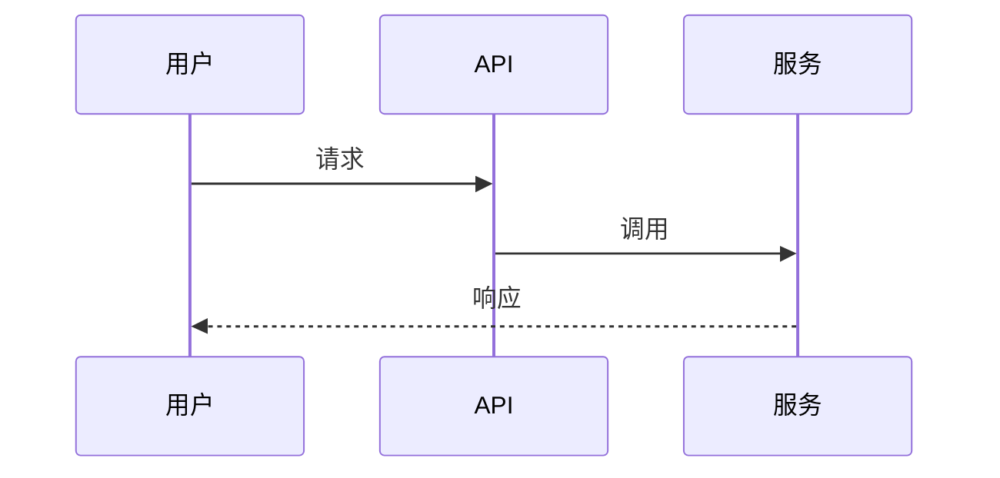

# <笔记标题>

> 元信息（复制后请填写）

| 项 | 值 |
|----|----|
| 主题 | <所属主题，如 检索与 RAG> |
| 创建日期 | YYYY-MM-DD |
| 最后更新 | YYYY-MM-DD |
| WeKnora 版本 | v0.8.0 |
| 代码快照 | commit `<hash>` |
| 状态 | 草稿 / 已整理 / 已验证 |

---

## 一句话结论

<用一句话说清这篇笔记最重要的结论，便于未来只读这里。>

---

## 背景与问题

- 想搞清楚什么？
- 为什么关心它（对二次开发 / 排障 / 性能有什么影响）？

## 关键结论

1. **结论一** —— 依据：`路径/文件.go:行号`
2. **结论二** —— 依据：<官方文档链接>

> 标注约定：
> - ✅ 已通过源码或实验验证
> - 🤔 推测，尚未验证
> - ⚠️ 踩坑 / 反直觉之处

## 调用链 / 流程

```text
入口（HTTP handler / MQ 消费者 / 定时任务）
  └─> application 层编排
        └─> 领域服务
              └─> 存储 / 外部服务
```

用 mermaid 或时序图补充，图片放 `assets/`：



## 源码索引

| 关注点 | 路径 | 说明 |
|--------|------|------|
| 接口定义 | `internal/...` | |
| 核心实现 | `internal/...` | |
| 配置项 | `internal/config/...` | |

## 实验记录

| 实验 | 环境 / 参数 | 结果 | 结论 |
|------|-------------|------|------|
|  |  |  |  |

## 待验证 / 待办

- [ ] 

## 参考

- 源码：`<相对路径>:<行号>`
- 官方文档：<链接>
- 相关笔记：<链接>
